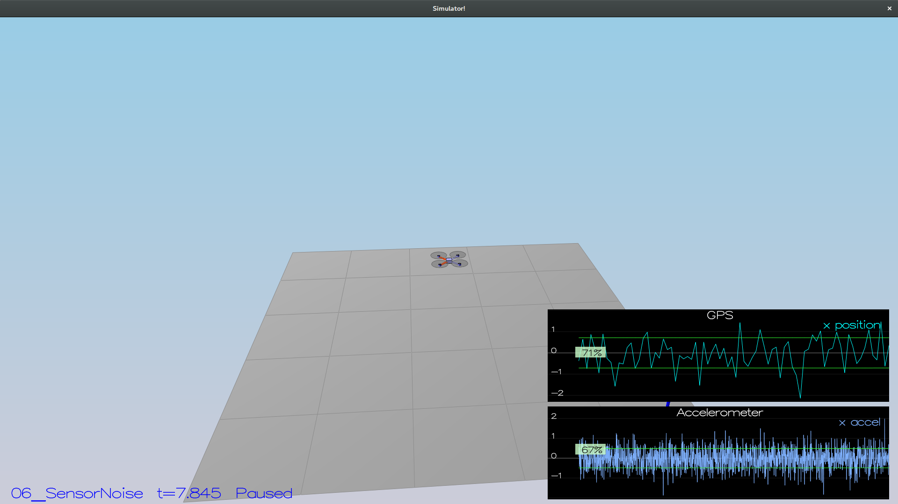
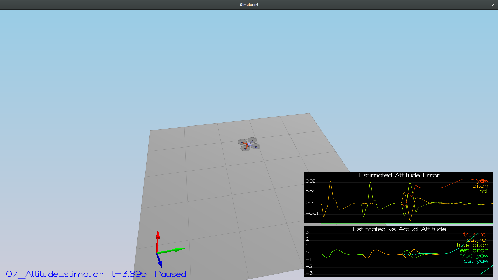
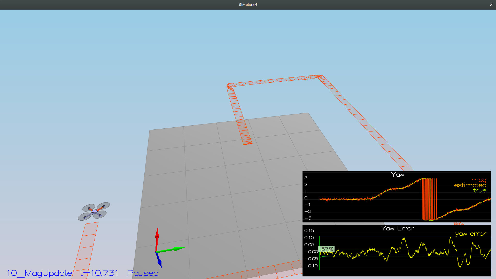
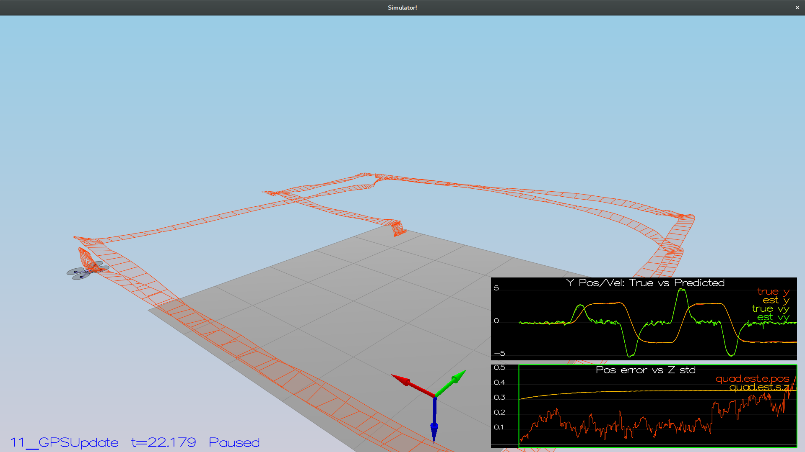
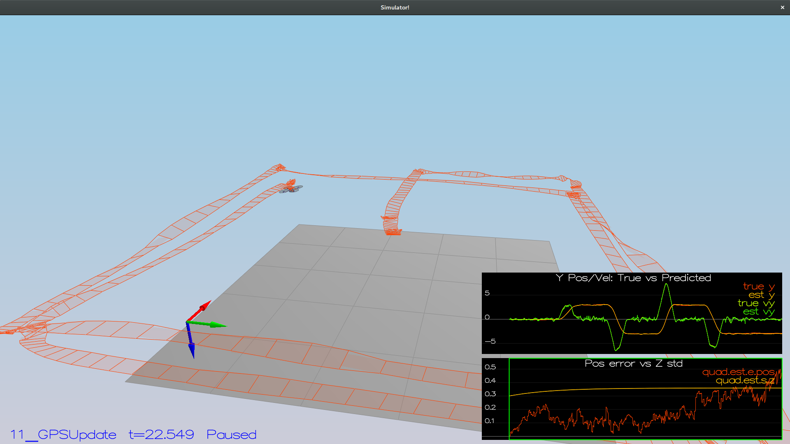

# Project Writeup #

## 1.Determine the standard deviation ##
I finished this step using excel from microsoft office, simply by seperate the time from data, the standard deviation can be easily caculated using built in function from excel.

Standard deviation of postion X from GPS and acceleration X from IMU are calculated as 0.713633 and 0.488362 respectivly.

## 2.Attitude Estimation ##
This part is implemented as suggested in the comment of UpdateFromIMU() function in QuadEstimatorEKF.cpp.

First, a Quaternion instance is created using estimated attitude from previous step. Then the quaternion were integrated with bodyrates measured by gyro. Finally the integrated quaternion were converted back to Euler angles. Then after applying the complementary filter, we have estimated attitude.

## 3.Prediction ##

### 3.1 PredictState ###
The first prediction function implemented was the PredictState() function. This function estimate the next state of drone (x, y, z, vx, vy, vz, yaw) using current state and readings from accelerometer and gyro.

Using fucntion number 49 in *Estimation for Quadrotors*, using reading from accelerometer and gyroscope as input *u*, the update function can be easily constructed. *$R_{bg}$* matrix was calculated using member fucntion of *Quaternion* class. Yaw was not updated, since it's been updated in the UpdatedFromIMU() function.

### 3.2 GetRbgPrime ###

GetRbgPrime() can be created easily using equation 52 in *Estimation for Quadrotors*.

### 3.3 Predict ###
the first is update predicted state; the second is update covariance parameters. The first step can be achieved once function predictState() is implemented. 

The second part require generate $g'$ properly. Using equation 50 in *Estimation for Quadrotors*, $g'$ can be calculated, furthermore, the covariance matrix of kalmam filter can be updated. 

## 4.Magnetometer Update ##

Most of the update tasks are implemented in Update() function which is provide. In UpdateFromMag() function, we only need to provide Update() function with proper inputs. Since the measurement matrix $h'$ is simple, therefor, the only tricky part was clipping around the circle. Since both estimation of kalman filter and reading from magnetometer are in $[-\pi, \pi]$, when magnetometer get a reading close to $\pi$, and yaw further, the reading will drop to $-\pi$. This create a problem when calculating error between sensor reading and estimation. To solve this, I check the value of both reading from sensor (magYaw) and estimated state (z(6)), add or substruct $2\pi$ to make sure inclusive angle is calculated.

## 5.GPS Update ##

UpdateFromGPS() can be easily implemented since the $h$ and $h'$ vector and matrix simple. The most challenging part is tune the process error parameter, this was carefully done by observing the deviation plotted in the graph.

## 6.Using in-house Built Controller ##

After replacing the QuadControl.cpp with previous version, the drone will crash when flying backward(heading $\pi$), soon I realized that was the same problem as magnetometer update. When heading $\pi$, if the drone turns slitest to $-\pi$ the yaw rate controller will generate a large input. Using similar solution as magnetometometer update function, the problem was fixed.

Then set the sensor to none idea type, the drone can fly around with error with 1 meter. No estimator parameter was changed.

## 7.Response to review ##
### 2nd Attempt ###
The magnenometer became a problem after repleacing controller source code. After tunning the magnenometer to meet the criteria for scenario 5, drone can no longer operate properly in scenario 7. With reduced deviation the drone will be more confident with speed estimation, as an result, PID controller will try to fix such noisy estimationn by making swift maneuvers, which cause crash. to fix this, I reduece the body rate and bank gain in controller parameters. 